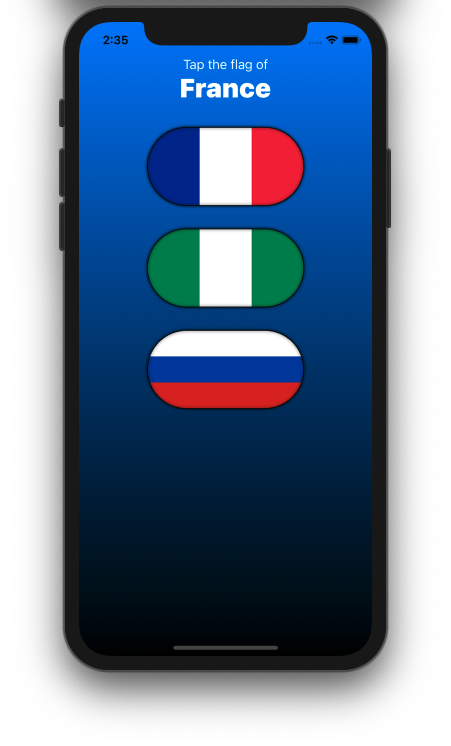
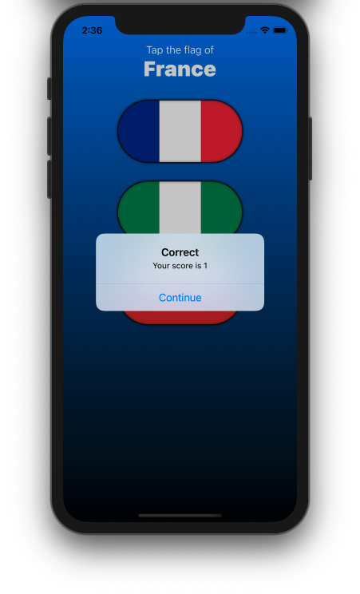
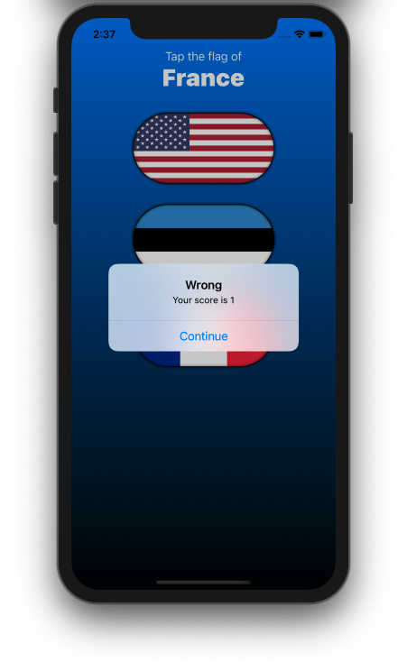

# Guess-the-Flag
Guess the Flag by Paul Hudson  In this SwiftUI project is a guessing game that helps you or users learn some of the many flags of the world.
I've added the score to this project. This project is very simple that gives a chance to introduce you to the whole range of SwiftUI functionality such as: stacks, buttons, images, alerts, asset catalogs and more. Thanks to Paul Hudson for his generous making the 100DaysOfSwiftUI to share his knowledge and skills about iOS Development.

here is the link of this project for you to learn more. https://www.hackingwithswift.com/100/swiftui/20

here are the screenshot of the app

